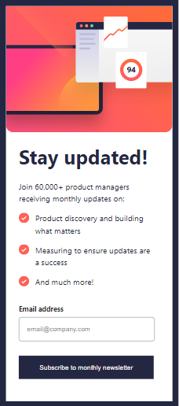
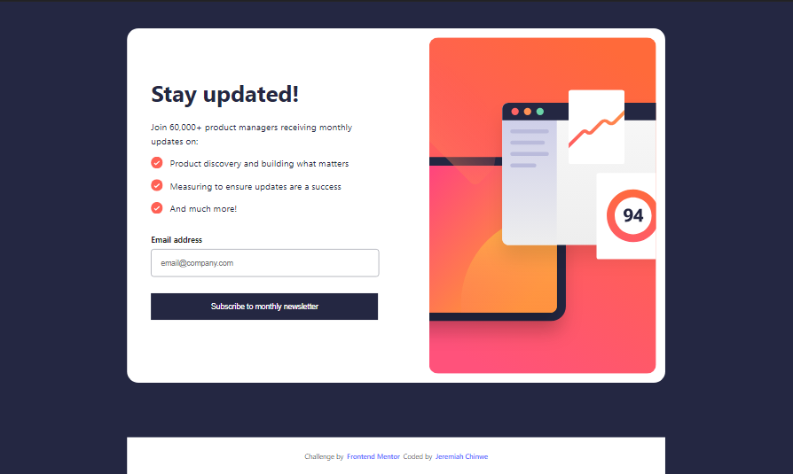

# Frontend Mentor - Newsletter sign-up form with success message solution

This is a solution to the [Newsletter sign-up form with success message challenge on Frontend Mentor](https://www.frontendmentor.io/challenges/newsletter-signup-form-with-success-message-3FC1AZbNrv). Frontend Mentor challenges help you improve your coding skills by building realistic projects. 

## Table of contents

- [Overview](#overview)
  - [The challenge](#the-challenge)
  - [Screenshot](#screenshot)
  - [Links](#links)
- [My process](#my-process)
  - [Built with](#built-with)
  - [What I learned](#what-i-learned)
- [Author](#author)

**Note: Delete this note and update the table of contents based on what sections you keep.**

## Overview

### The challenge

Users should be able to:

- Add their email and submit the form
- See a success message with their email after successfully submitting the form
- See form validation messages if:
  - The field is left empty
  - The email address is not formatted correctly
- View the optimal layout for the interface depending on their device's screen size
- See hover and focus states for all interactive elements on the page

### Screenshots

### Links

- Solution URL: [See Solution here](https://www.frontendmentor.io/challenges/newsletter-signup-form-with-success-message-3FC1AZbNrv/hub)
- Live Site URL: [Vercel](https://newsletter-signup-ashen-delta.vercel.app/)

## My process

### Built with

- Semactic HTML5 markup
- Flexbox
- [React](https://reactjs.org/) - JS library
- Mobile-first workflow

### What I learned

Building this project, I learned that Flexbox is more handy and works better for me than Grid.

## Author

- Frontend Mentor - [@JeremiahChinwe](https://www.frontendmentor.io/profile/JeremiahChinwe)
- Twitter - [@jeremiahchinwe](https://www.twitter.com/jeremiahchinwe)
